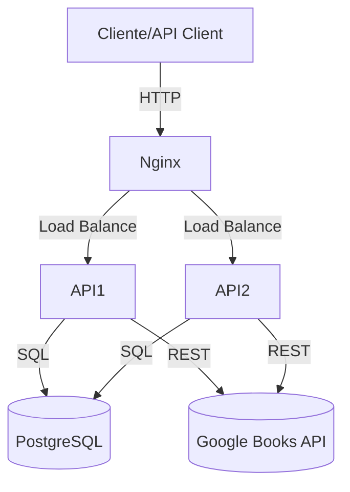

<h1 align="center">📚 BookFinder-Api</h1>

<p align="center">
  <a href="https://github.com/DaniDMoura/BookFinder-Api/blob/main/LICENSE">
    
  </a>
</p>

<p align="center">
  <b>Uma API simples e poderosa para busca de livros — ideal para desenvolvedores, entusiastas da leitura e plataformas educacionais.</b>
</p>

---


### Exemplos visuais:

- Retorno de detalhes completos do livro (capa, sinopse, autor, etc.)
- Integração com Google Books API

---

## 🚀 Instalação & Configuração

### Pré-requisitos

- [Docker](https://docs.docker.com/get-docker/) 20.10+
- [Docker Compose](https://docs.docker.com/compose/) 2.0+
- (Opcional) Python 3.10+ e pip

### Tutorial rápido com Docker Compose

```bash
# Clone do repositório
git clone https://github.com/DaniDMoura/BookFinder-Api.git
cd BookFinder-Api

# Configuração de ambiente
cp .env.example .env
# Edite as variáveis necessárias (.env)

# Execução com Docker Compose
docker-compose up -d

# Verificação dos containers
docker-compose ps

# Logs (se necessário)
docker-compose logs -f

# Para parar
docker-compose down
```

> ⚠️ **Dica:** Edite `.env` com suas credenciais e variáveis de ambiente.

---

## 🛠️ Como Funciona

### Arquitetura



- **Nginx:** balanceia requisições entre múltiplas instâncias da API
- **API1/API2:** instâncias FastAPI para alta disponibilidade
- **PostgreSQL:** persistência dos dados locais
- **Google Books API:** enriquecimento dos dados de livros

### Fluxo de dados

1. Usuário faz requisição HTTP para o Nginx
2. Nginx direciona para uma das APIs
3. API consulta banco local e/ou Google Books API
4. Resposta consolidada é retornada ao usuário

### Tecnologias

| Tecnologia      | Motivo de escolha                |
|-----------------|----------------------------------|
| Python/FastAPI  | Performance e tipagem moderna    |
| PostgreSQL      | Banco relacional robusto         |
| Docker Compose  | Facilidade de orquestração local |
| Nginx           | Load Balancer flexível           |

### Estrutura de Pastas

```
BookFinder-Api/
├── api/                # Código principal da API (FastAPI)
│   ├── main.py
│   ├── models.py
│   ├── routes/
│   └── ...
├── migrations/         # Migrações do banco
├── docker-compose.yml  # Orquestração com Docker
├── nginx.conf          # Configuração do Nginx
├── pyproject.toml      # Configuração do projeto
├── uv.lock             # Dependências Python
├── .env.example        # Exemplo de variáveis de ambiente
└── ...
```

---

## 📖 Documentação de Uso

### Exemplos de uso

#### Busca de livros

```http
GET /books?title=harry+potter
Authorization: Bearer <seu_token>
```

Resposta:
```json
{
  "books": [
    {
      "title": "Harry Potter e a Pedra Filosofal",
      "authors": ["J.K. Rowling"],
      "description": "...",
      ...
    }
  ]
}
```

### Endpoints Principais

| Método | Endpoint     | Descrição                   |
|--------|--------------|-----------------------------|
| GET    | /books       | Busca livros por filtros    |
| GET    | /books/{id}  | Detalhes de um livro        |
| POST   | /users/login | Autenticação JWT            |
| ...    | ...          | ...                         |

### Configurações Disponíveis

- `DATABASE_URL`, `SECRET_KEY`, `GOOGLE_BOOKS_API_KEY`, etc. (ver `.env.example`)

### Comandos Úteis

- `docker-compose up -d` – sobe toda a stack localmente
- `docker-compose down` – encerra a stack

---

## 👩‍💻 Desenvolvimento

### Ambiente de Desenvolvimento

```bash
# (Opcional) Para rodar localmente sem Docker:
uv venv
source venv/bin/activate
uv sync
cp .env.example .env
# Edite as variáveis e rode a API
fastapi dev api/main.py
```


### Como Contribuir

1. Fork este repositório
2. Crie sua branch (`git checkout -b feat/minha-feature`)
3. Commit e push
4. Abra um Pull Request

#### Build

- Build automático via Dockerfile e Compose

---

<details>
<summary>❓ FAQ</summary>

- **Como obtenho uma chave do Google Books API?**
  Siga as instruções [aqui](https://developers.google.com/books/docs/v1/using#APIKey).

- **Posso rodar sem Docker?**
  Sim, basta instalar Python, dependências e PostgreSQL local.

- **Como resetar o banco de dados?**
  Pare os containers, remova o volume `postgres_data` e suba novamente.
</details>

<details>
<summary>🛠️ Troubleshooting</summary>

- API não sobe? Verifique `.env` e logs com `docker-compose logs`.
- Porta 80 ocupada? Edite o `docker-compose.yml` e `nginx.conf`.
</details>

<details>
<summary>📝 Changelog</summary>

- v1.0.0 – Primeira versão estável
- ...
</details>

<details>
<summary>🚧 Roadmap</summary>

- [ ] Autenticação OAuth
- [ ] Integração com outras APIs de livros
- [ ] Deploy automático (CI/CD)
</details>

---

## 📄 Licença

Distribuído sob licença MIT. Veja o arquivo [LICENSE](LICENSE).

## 👥 Contribuidores

<!-- Gere esta seção automaticamente usando ferramentas como all-contributors -->
<a href="https://github.com/DaniDMoura">
  
</a>
<!-- Adicione mais contribuidores aqui -->

## 💬 Suporte

Abra uma issue ou entre em contato via [GitHub Discussions](https://github.com/DaniDMoura/BookFinder-Api/discussions) <!-- ou outro canal preferido -->

---

